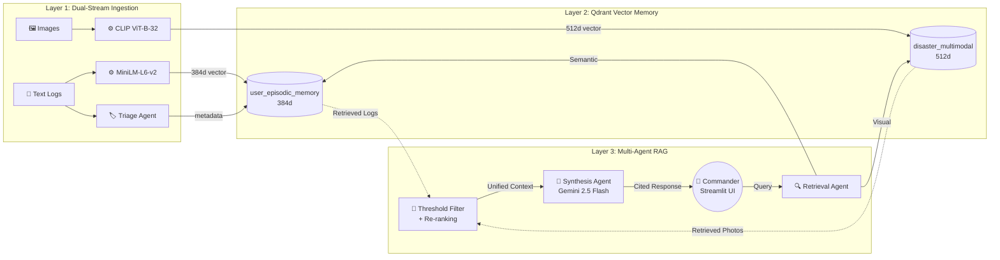

# 🚨 Crisis Intelligence Command Center

**A Multimodal RAG System for National Disaster Response**

[](https://python.org)
[](https://streamlit.io)
[](https://qdrant.tech)
[](https://ai.google.dev)
[](https://openai.com/research/clip)

---

## 📖 Overview

In the chaotic aftermath of natural disasters, critical information is fragmented across radio logs, text reports, and visual evidence (drone/CCTV footage). The **Crisis Intelligence Command Center** bridges this gap.

This is a **Multimodal Retrieval-Augmented Generation (RAG)** system with a **multi-agent architecture** that allows emergency responders to:

1. **Ingest** text logs and images with automatic severity classification and geocoding
2. **Query** using natural language (e.g., *"Show me flooding in Assam"*)
3. **Retrieve** grounded evidence — the AI fetches matching text reports *and* visual evidence
4. **Visualize** crisis data on an interactive GIS map with severity indicators
5. **Analyze** disaster statistics through an analytics dashboard

---

## 🧠 System Architecture

### Multi-Agent Pipeline

The system uses three specialized agents that form a pipeline:

```
User Query → [Retrieval Agent] → [Triage Agent] → [Synthesis Agent] → Response
                    ↓                    ↓                  ↓
              Parallel Search    Severity/Type       Gemini LLM with
              (Text + CLIP)     Classification      Citation Protocol
```

### Architecture Layers

| Layer | Component | Technology |
|-------|-----------|-----------|
| **Ingestion** | Text encoding | `all-MiniLM-L6-v2` (384d vectors) |
| | Image encoding | `CLIP ViT-B-32` (512d vectors) |
| | Metadata enrichment | Triage Agent (severity, disaster type, geocoding) |
| **Storage** | Text memory | Qdrant `user_episodic_memory` collection |
| | Visual memory | Qdrant `disaster_multimodal` collection |
| **Retrieval** | Semantic search | Dual-stream parallel vector search |
| | Filtering | Metadata filters (disaster type, severity, region) |
| | Re-ranking | Recency-based score adjustment with decay |
| **Generation** | LLM synthesis | Google Gemini 2.5 Flash with citation protocol |
| **UI** | Dashboard | Streamlit with custom dark theme |
| | Map | Folium with geocoded disaster markers |
| | Analytics | Plotly charts (severity, type, region distribution) |

### Architecture Diagram



---

## 🛠️ Installation & Setup

### Prerequisites
- Python 3.11+ (Conda recommended)
- [Qdrant Cloud](https://cloud.qdrant.io/) account (free tier works)
- [Google AI Studio](https://aistudio.google.com/) API key

### 1. Clone & Setup Environment

```bash
git clone https://github.com/Aizen0003/Crisis-Intelligence-AI.git
cd Crisis-Intelligence-AI

# Create conda environment
conda create --name convolve_env python=3.11 -y
conda activate convolve_env

# Install dependencies
pip install -r requirements.txt --extra-index-url https://download.pytorch.org/whl/cpu
```

### 2. Configure API Keys

```bash
cp .env.example .env
# Edit .env with your actual keys
```

```ini
GEMINI_API_KEY=your_google_api_key
QDRANT_URL=https://your-cluster.cloud.qdrant.io:6333
QDRANT_API_KEY=your_qdrant_api_key
```

### 3. Ingest Data

```bash
python ingest_bulk.py
```

This will:
- Encode 61 Pan-India disaster text logs with MiniLM-L6-v2
- Encode 26 disaster images with CLIP ViT-B-32
- Auto-classify disaster types and severity levels
- Geocode locations for map visualization

### 4. Run the Application

```bash
streamlit run app.py
```

---

## 💡 Key Features

### 🤖 Multi-Agent Architecture
Three specialized agents handle different aspects of the pipeline:
- **Triage Agent**: Classifies disaster type and severity using keyword heuristics
- **Retrieval Agent**: Orchestrates parallel search with metadata filtering
- **Synthesis Agent**: Generates cited, evidence-grounded responses via Gemini

### 🔍 Advanced Qdrant Integration
- **Dual collections** with different vector dimensions (384d text, 512d CLIP)
- **Metadata filtering** by disaster type, severity, and region
- **Smart memory management**: "Safe Reset" preserves base data while clearing conversation history
- **Recency-based decay**: Older memories get reduced relevance scores

### 🗺️ Interactive Crisis Map
- Folium map centered on India with CartoDB dark tiles
- Color-coded markers by disaster type (flood=blue, fire=red, etc.)
- Interactive popups with severity badges and report excerpts
- Severity and type distribution summaries

### 📊 Analytics Dashboard
- Plotly charts: disaster type pie chart, severity bar chart, regional distribution
- Real-time Qdrant collection health metrics
- Source agency breakdown

### 🧠 Evidence-Based Responses
- All AI responses cite specific sources (`[Source 1]`, `[Source 2]`)
- Expandable reasoning trace shows what was retrieved and why
- Similarity scores displayed for full transparency

---

## 📂 Project Structure

```
Crisis-Intelligence-AI/
├── app.py                      # Main Streamlit entry point
├── ingest_bulk.py              # Data ingestion with metadata enrichment
├── requirements.txt            # Python dependencies
├── .env.example                # API key template
├── data_logs.txt               # 61 Pan-India disaster text logs
├── data_images/                # 26 disaster photographs
├── src/
│   ├── config.py               # Centralized configuration & constants
│   ├── embeddings.py           # Text & CLIP encoder wrappers
│   ├── qdrant_manager.py       # Qdrant CRUD operations
│   ├── retrieval.py            # Search engine with re-ranking
│   ├── memory.py               # Episodic memory lifecycle
│   ├── agents/
│   │   ├── triage_agent.py     # Disaster type & severity classifier
│   │   ├── retrieval_agent.py  # Multi-collection search orchestrator
│   │   └── synthesis_agent.py  # Gemini-powered response generator
│   ├── ui/
│   │   ├── dashboard.py        # Main dashboard layout
│   │   ├── chat.py             # Chat interface component
│   │   ├── map_view.py         # Folium GIS map component
│   │   ├── analytics.py        # Plotly analytics dashboard
│   │   └── styles.py           # Custom dark theme CSS
│   └── utils/
│       ├── location_extractor.py  # Geocoding utility
│       └── logger.py              # Structured logging
├── documents/
│   ├── Final_Report.md         # Project report (10 pages)
│   └── architecture.png        # System architecture diagram
└── README.md
```

---

## ⚠️ Limitations

| Limitation | Detail |
|---|---|
| **API Dependency** | Requires internet for Gemini and Qdrant Cloud |
| **Semantic Ambiguity** | Low-data scenarios may force incorrect matches |
| **CLIP Bias** | Model may underperform on South Asian rural landscapes |
| **Privacy** | Production deployment must comply with DPDP Act 2023 |
| **Human-in-the-Loop** | AI suggestions must always be verified by commanders |

---

## 🚀 Future Roadmap

- [ ] Voice interface via Speech-to-Text for radio commands
- [ ] Local LLM deployment (Llama 3) for offline operation
- [ ] Real-time data streaming from social media APIs
- [ ] Satellite imagery integration for damage assessment
- [ ] Multi-language support for regional disaster communication

---

## 📜 License

This project was built for **Convolve 4.0**, a Pan-IIT AI/ML Hackathon, as part of the Qdrant problem statement on *Search, Memory, and Recommendations for Societal Impact*.
