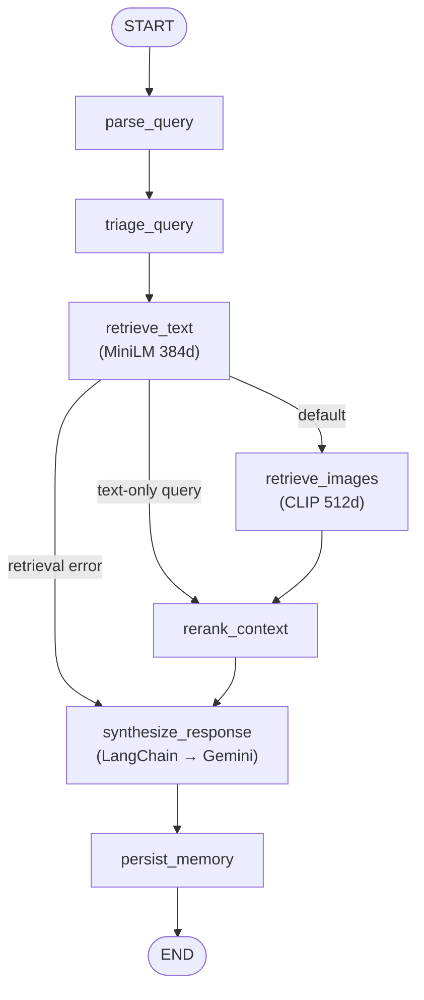

# 🚨 Crisis Intelligence Command Center

**A Multimodal RAG System for National Disaster Response**

[](https://python.org)
[](https://streamlit.io)
[](https://qdrant.tech)
[](https://ai.google.dev)
[](https://openai.com/research/clip)

---

## 📖 Overview

In the chaotic aftermath of natural disasters, critical information is fragmented across radio logs, text reports, and visual evidence (drone/CCTV footage). The **Crisis Intelligence Command Center** bridges this gap.

This is a **LangGraph-orchestrated, LangChain-powered Multimodal Retrieval-Augmented Generation (RAG)** system that allows emergency responders to:

1. **Ingest** text logs and images with automatic severity classification and geocoding
2. **Query** using natural language (e.g., *"Show me flooding in Assam"*)
3. **Retrieve** grounded evidence — the workflow fetches matching text reports *and* visual evidence
4. **Visualize** crisis data on an interactive GIS map with severity indicators
5. **Analyze** disaster statistics through an analytics dashboard

---

## 🧠 System Architecture

### LangGraph-Orchestrated RAG Pipeline

The RAG pipeline is modeled as an explicit, **typed state machine** built with
`langgraph.graph.StateGraph` (`src/graph/crisis_graph.py`). Each step is a node;
state flows through a `TypedDict` (`src/graph/state.py`). Gemini access and the
synthesis prompt are standardized through **LangChain** (`ChatGoogleGenerativeAI`
+ `ChatPromptTemplate`), and Qdrant text/image search is wrapped behind LangChain
`BaseRetriever` adapters.

| Node | Responsibility |
|------|----------------|
| `parse_query` | Detect text-only intent; normalize UI filters → Qdrant metadata filters |
| `triage_query` | Heuristic disaster-type / severity of the query (keyword-based) |
| `retrieve_text` | MiniLM 384d search over base reports (`role="system_report"`) |
| `retrieve_images` | CLIP 512d cross-modal search (skipped on text-only queries) |
| `rerank_context` | Recency decay + image dedupe + build cited LLM context blocks |
| `synthesize_response` | Grounded, cited answer via LangChain `ChatGoogleGenerativeAI` |
| `persist_memory` | Store the turn in episodic memory (non-fatal) |

**Conditional routing:** text-only queries skip image retrieval entirely; if core
text retrieval fails, the graph short-circuits to a graceful, actionable error
instead of calling the LLM.

### Architecture Layers

| Layer | Component | Technology |
|-------|-----------|-----------|
| **Orchestration** | RAG state machine | LangGraph `StateGraph` (typed nodes + conditional edges) |
| | LLM + prompts | LangChain `ChatGoogleGenerativeAI` + `ChatPromptTemplate` |
| | Retrievers | LangChain `BaseRetriever` adapters over Qdrant |
| **Ingestion** | Text encoding | `all-MiniLM-L6-v2` (384d vectors) |
| | Image encoding | `CLIP ViT-B-32` (512d vectors) |
| | Metadata enrichment | Triage heuristics (severity, disaster type, geocoding) |
| **Storage** | Text memory | Qdrant `user_episodic_memory` collection (384d) |
| | Visual memory | Qdrant `disaster_multimodal` collection (512d) |
| **Retrieval** | Semantic search | Dual-stream text + cross-modal image vector search |
| | Filtering | Disaster-type metadata filter (UI) + triage-inferred fallback; severity/region accepted programmatically |
| | Re-ranking | Recency-based score decay (meaningful for conversation-memory turns) |
| **Generation** | LLM synthesis | Google Gemini 2.5 Flash with citation protocol |
| **UI** | Dashboard | Streamlit with custom dark theme |
| | Map | Folium with geocoded disaster markers |
| | Analytics | Plotly charts (severity, type, region distribution) |

### LangGraph Workflow Diagram



---

## 🛠️ Installation & Setup

### Prerequisites
- Python 3.11+ (Conda recommended)
- [Qdrant Cloud](https://cloud.qdrant.io/) account (free tier works)
- [Google AI Studio](https://aistudio.google.com/) API key

### 1. Clone & Setup Environment

```bash
git clone https://github.com/Aizen0003/Crisis-Intelligence-AI.git
cd Crisis-Intelligence-AI

# Create conda environment
conda create --name convolve_env python=3.11 -y
conda activate convolve_env

# Install dependencies
pip install -r requirements.txt --extra-index-url https://download.pytorch.org/whl/cpu
```

### 2. Configure API Keys

```bash
cp .env.example .env
# Edit .env with your actual keys
```

```ini
GEMINI_API_KEY=your_google_api_key
QDRANT_URL=https://your-cluster.cloud.qdrant.io:6333
QDRANT_API_KEY=your_qdrant_api_key
```

### 3. Ingest Data

```bash
python3 ingest_bulk.py
```

This will:
- Encode 61 Pan-India disaster text logs with MiniLM-L6-v2
- Encode 26 disaster images with CLIP ViT-B-32
- Auto-classify disaster types and severity levels
- Geocode locations for map visualization

Ingestion is **idempotent**: point IDs are deterministic content hashes, so
re-running `python3 ingest_bulk.py` updates existing points instead of creating
duplicates.

### 4. Run the Application

```bash
streamlit run app.py
```

### 5. Run the Tests

Unit tests mock Qdrant and Gemini and require **no API keys**:

```bash
pytest
```

---

## 💡 Key Features

### 🤖 LangGraph + LangChain Orchestration
- **LangGraph** runs the RAG pipeline as a typed state machine with explicit nodes and conditional routing
- **LangChain** standardizes Gemini prompting (`ChatPromptTemplate`) and model invocation (`ChatGoogleGenerativeAI`)
- **LangChain retrievers** wrap Qdrant text (MiniLM) and image (CLIP) vector search
- **Triage** classifies the query's disaster type and severity via keyword heuristics; the inferred disaster type is used as an automatic fallback retrieval filter when the user hasn't set one

### 🔍 Advanced Qdrant Integration
- **Dual collections** with different vector dimensions (384d text, 512d CLIP)
- **Metadata filtering**: the UI exposes a disaster-type filter (with an automatic triage-inferred fallback); the retriever also accepts severity/region filters programmatically
- **Smart memory management**: "Safe Reset" preserves base data while clearing conversation history
- **Recency-based decay**: timestamped conversation-memory turns lose relevance with age (base reports share a single ingest timestamp, so decay does not differentiate among them)

### 🗺️ Interactive Crisis Map
- Folium map centered on India with CartoDB dark tiles
- Color-coded markers by disaster type (flood=blue, fire=red, etc.)
- Interactive popups with severity badges and report excerpts
- Severity and type distribution summaries

### 📊 Analytics Dashboard
- Plotly charts: disaster type pie chart, severity bar chart, regional distribution
- Real-time Qdrant collection health metrics
- Source agency breakdown

### 🧠 Evidence-Based Responses
- All AI responses cite specific sources (`[Source 1]`, `[Source 2]`)
- Expandable reasoning trace shows what was retrieved and why
- Similarity scores displayed for full transparency

---

## 📂 Project Structure

```
Crisis-Intelligence-AI/
├── app.py                      # Main Streamlit entry point
├── ingest_bulk.py              # Idempotent data ingestion with metadata enrichment
├── requirements.txt            # Python dependencies
├── .env.example                # API key template (copy to .env)
├── LICENSE                     # MIT license
├── data_logs.txt               # 61 Pan-India disaster text logs
├── data_images/                # 26 disaster photographs
├── src/
│   ├── config.py               # Centralized configuration, constants & validation
│   ├── embeddings.py           # Text & CLIP encoder wrappers
│   ├── qdrant_manager.py       # Qdrant CRUD + deterministic IDs + search
│   ├── retrieval.py            # Recency-decay helper (shared)
│   ├── memory.py               # Episodic memory lifecycle
│   ├── graph/                  # ── LangGraph workflow ──
│   │   ├── state.py            # Typed CrisisState (TypedDict)
│   │   └── crisis_graph.py     # StateGraph nodes + run_crisis_graph()
│   ├── langchain_adapters/     # ── LangChain seams ──
│   │   ├── llm.py              # ChatGoogleGenerativeAI + ChatPromptTemplate
│   │   └── retrievers.py       # BaseRetriever adapters over Qdrant
│   ├── agents/
│   │   ├── triage_agent.py     # Disaster type & severity classifier (heuristic)
│   │   ├── retrieval_agent.py  # Legacy helper (image-suppression heuristic)
│   │   └── synthesis_agent.py  # Compat shim → LangChain LLM adapter
│   ├── ui/
│   │   ├── dashboard.py        # Main dashboard layout
│   │   ├── chat.py             # Chat interface (calls run_crisis_graph)
│   │   ├── map_view.py         # Folium GIS map component
│   │   ├── analytics.py        # Plotly analytics dashboard
│   │   └── styles.py           # Custom dark theme CSS
│   └── utils/
│       ├── location_extractor.py  # Geocoding utility
│       └── logger.py              # Structured logging
├── tests/                      # pytest suite (mocks Qdrant + Gemini, no keys)
├── documents/
│   ├── Final_Report.md         # Project report (10 pages)
│   └── architecture.png        # System architecture diagram
└── README.md
```

---

## ⚠️ Limitations

| Limitation | Detail |
|---|---|
| **API Dependency** | Requires internet for Gemini and Qdrant Cloud |
| **Semantic Ambiguity** | Low-data scenarios may force incorrect matches |
| **CLIP Bias** | Model may underperform on South Asian rural landscapes |
| **Privacy** | Production deployment must comply with DPDP Act 2023 |
| **Human-in-the-Loop** | AI suggestions must always be verified by commanders |

---

## 🚀 Future Roadmap

- [ ] Voice interface via Speech-to-Text for radio commands
- [ ] Local LLM deployment (Llama 3) for offline operation
- [ ] Real-time data streaming from social media APIs
- [ ] Satellite imagery integration for damage assessment
- [ ] Multi-language support for regional disaster communication

---

## 🎤 How to Explain This in an Interview

A truthful, 60-second walkthrough you can memorize:

- **LangGraph orchestrates the RAG pipeline as a typed state machine.** Each step
  (`parse_query → triage_query → retrieve_text → retrieve_images → rerank_context
  → synthesize_response → persist_memory`) is a node, and conditional edges skip
  image retrieval for text-only queries and short-circuit on retrieval failure.
- **LangChain standardizes the model layer.** Gemini is invoked through
  `ChatGoogleGenerativeAI` with a reusable `ChatPromptTemplate`, and Qdrant search
  is exposed through LangChain `BaseRetriever` adapters.
- **Qdrant stores two separate vector spaces** — a 384d text collection and a 512d
  image collection — so embedding dimensions never mix.
- **MiniLM (`all-MiniLM-L6-v2`) handles text retrieval**; **CLIP (`ViT-B-32`)
  handles image retrieval from text queries** via shared text–image embedding space.
- **Gemini 2.5 Flash generates grounded, cited responses** strictly from retrieved
  evidence (`[Source N]` citations).
- **Streamlit exposes the operational dashboard** (chat, map, analytics).
- **Triage (disaster type + severity) is heuristic keyword matching**, not a trained
  model — stated honestly. The triaged disaster type feeds a *soft fallback*
  retrieval filter when the user hasn't picked one (and is shown in the evidence
  panel's reasoning trace); triaged **severity is deliberately NOT used as a
  filter** because keyword severity is too noisy to hard-filter on. The UI sidebar
  therefore exposes only a disaster-type filter — no dead controls.
- **Engineering touches:** idempotent ingestion via deterministic content-hash point
  IDs, base-evidence retrieval filtered to `role="system_report"` so conversation
  memory doesn't pollute grounding, actionable error surfacing instead of silent
  failures, and a mocked pytest suite that needs no API keys.

---

## 📜 License

Licensed under the [MIT License](LICENSE).

This project was originally built for **Convolve 4.0**, a Pan-IIT AI/ML Hackathon, as part of the Qdrant problem statement on *Search, Memory, and Recommendations for Societal Impact*.
